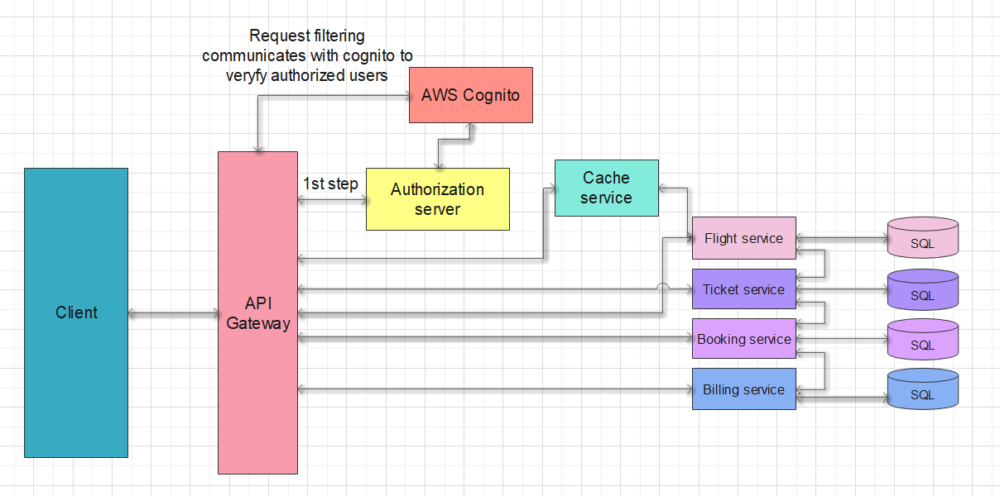

Flight Booking System
---------------------

* [List of services](#list-of-services)
* [Description of outbound API endpoints](#endpoints-overview)
* [Description of inbound API endpoints](#endpoints-overview)
* [List of technologies to be used](#list-of-technologies)
* [Diagram reflecting the architecture of the system](#architecture-diagram)

### List Of Services

--------
- auth-service
- user-service
- ticket-service
- flight-service
- plane-service
- seat-service
- gateway-service
- booking-service
- billing-service
- caching-service

### Endpoints Overview

(As I have not understood properly the concept of outbound
and inbound APIs I have decided to describe them in one group for now)

---------

**_Auth service_**
+ A part of API Gateway.

**_User service_**
+ This service will handle connection to the Auth service
when a new user signs up.
+ GET `user-service/user-profiles/get-user` : get user-profile by parameter - id or username
+ POST `user-service/user-profiles/user` : create new user

**_Ticket service_**
+ GET `ticket-service/tickets/get-ticket` : will return ticket by ticket id, username or user-id
+ Possible variations of parameters to be added

**_Flight service_**
+ GET `flight-service/flights/get-flight` : get one flight by parameter - id / info
+ GET `flight-service/flights/get-flights` : retrieve all the flights that matches the value of query param
+ GET `flight-service/airports/get-airports` : get a list of airports + parameter to find by airport name
+ Search flight by name
+ Search flight by code

**_Gateway service_**
+ Will handle routing of the requests sent between one service to another.
+ Here will be Round Robin Routing logic
+ Circuit Breaker

**_Booking service_**
+ User can book a flight ticket and fill the personal information - billing information
+ POST `booking-service/flights/{flight-id}/booking ` : will book a flight by flight id
+ Get booking details

**_Billing service_**
+ User can pay the flight order
+ GET `billing-service/flights/{flight-id}/payment` : will pay for the flight specified
+ Make payment(handle payment errors: payment authorization timeout and invalid credit card info )

**_Seat service_**
+ GET `seat-service/seats/get-seat` : get seat by parameter - id
+ GET `seat-service/seats/{plane-id}/all-seats` : will return all the seats for one plane

**_Plane service_**
+ GET `plane-service/planes/get-plane` : get plane by id
+ POST `plane-service/planes/add-plane` : add plane
**_Caching service_**
+ Will implement keep-alive connection for other services
+ Will handle multiple simultaneous connections

### List Of Technologies

-------

+ JDK 11.0.10
+ Spring Boot
+ Spring Cloud
+ Spring Data
+ DBs which will be used, have not decided yet(Possibly PostgreSQL and MongoDB)

### Architecture Diagram

------

