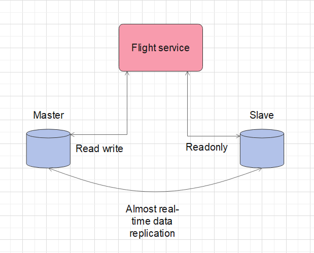
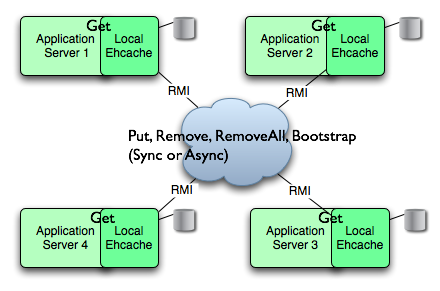
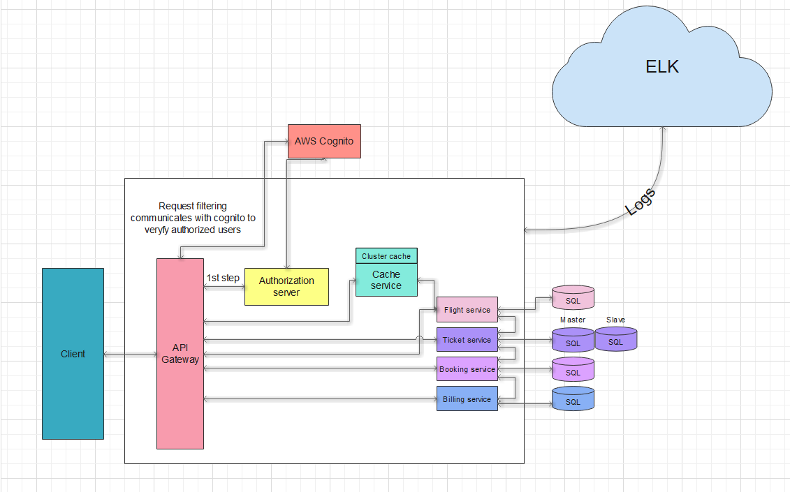

Flight Booking System
---------------------

##  _Feature list for laboratory work number 2_

###  1.ELK stack

I would implement Elasticsearch logstash and kibana for logs registering for each of existing services of my lab. ELK stack will be running on dockerized container.

###  2.Database redundancy/replication + failover

 For the flight service I am going to implement a master-slave replication of Postgresql database.
to provide two identical databases for specified service. Master will be set up to be able to read and write the information from the database.
Slave is going to be set to read only. Data transferring between two on them will be synchronous.

###  3.EhCache RMI replicated cache.

For Cache service I will implement replicated caching for flight service calls using ehcache configurations in ehcache.xml file.

###  4. All the microservices are going to be runt from the docker container using docker compose file

-------------------------

####  _No new technologies will be introduced_

-------------------------

### Final Architecture Diagram

